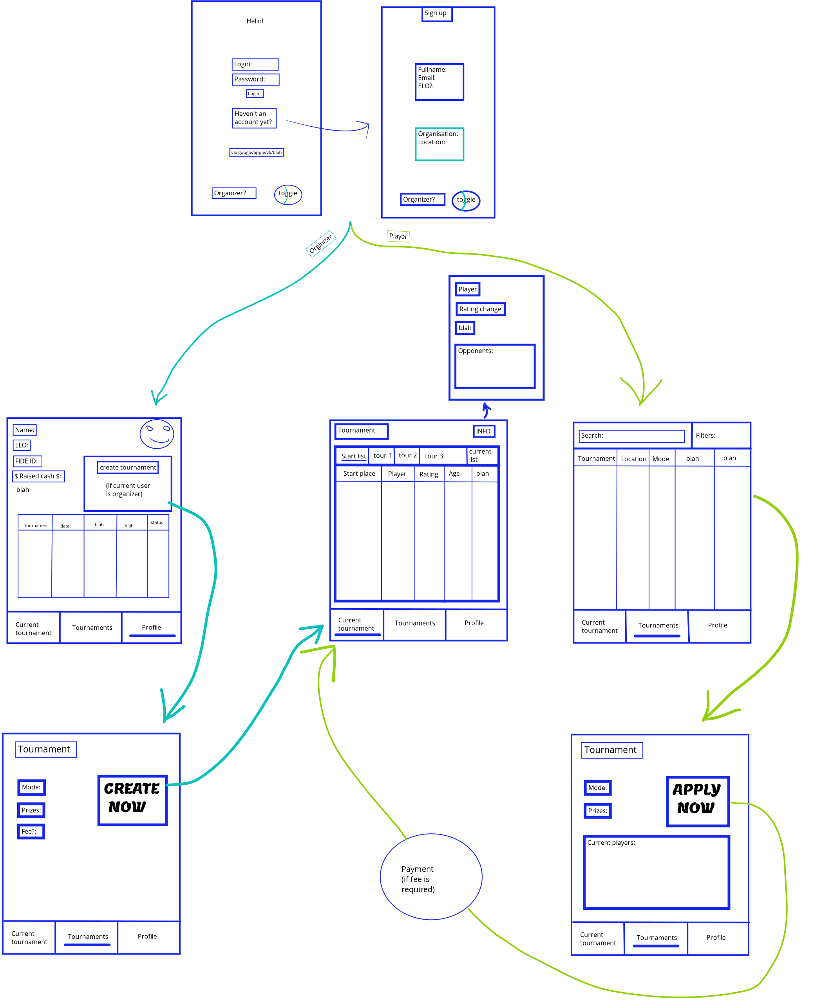

### Агрегатор шахматных турниров делает ровно то, что напрашивается из назавния, а именно: 
+ позволяет организаторам публиковать анонсы турниров, собирать заявки участников и предоставлять игрокам актуальную информацию в процессе турнира. 
+ позволяет участникам искать турниры, подавать заявку и следить за турнирным положением соответсвенно. 

---

### Основные экраны приложения: 
+ Авторизация/регистрация
+ Профиль
+ Турниры
+ Текущий турнир
+ Подача заявки участника
+ Создание турнира организатором

---

### Что можно сделать, если будет время:
+ Верификация организатора
+ Платежка участника при подаче заявки
+ Жеребьвка следующего тура
+ Сортировка турниров в ленте по релевантности
+ База партий в .png

#### Что можно сделать, если будет пиво и время:
+ (Организатор) Сканер бланков партий в выгрузкой в БД .png
+ (Участник) Просмотр партий из этой БД

---

### Roadmap
1. Авторизация, регистрация ??
2. Профиль, создание турнира ??
3. Layout - 2 ноября ??
4. Networking - 9 ноября ??
5. БД турниров - 30 ноября ??
6. ????
---

